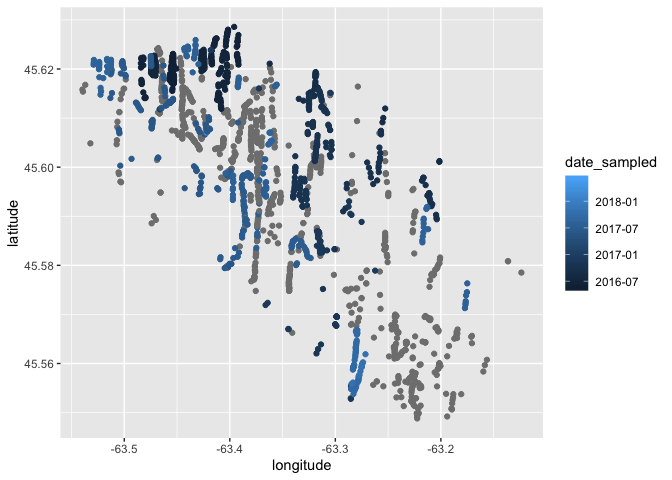
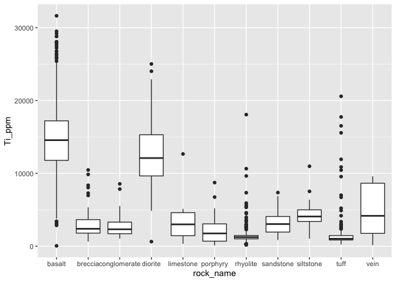
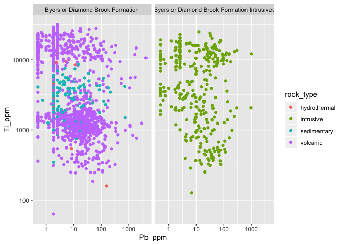

<!-- README.md is generated from README.Rmd. Please edit that file -->
geoscidata
==========

The goal of geoscidata is to provide interesting and relevant datasets for geoscientists learning R.

Installation
------------

You can install geoscidata from GitHub using:

``` r
# install.packages("remotes")
remotes::install_github("paleolimbot/geoscidata")
```

If you can load the without errors, you've installed it correctly!

``` r
library(geoscidata)
```

The `warwick` dataset
---------------------

This dataset is a data frame of rock samples collected in multiple field seasons by the Nova Scotia Department of Energy and Mines in the Warwick Mountain area of Nova Scotia, Canada. It contains qualitative information about rock types, as well as pXRF-measured geochemistry. For more information, see the [dataset download page](https://novascotia.ca/natr/meb/download/dp505.asp).

``` r
warwick
#> # A tibble: 1,863 x 44
#>    station_id sample_id longitude latitude type  rock_type rock_name
#>    <chr>      <chr>         <dbl>    <dbl> <chr> <chr>     <chr>    
#>  1 15GB0001   15GB0001      -63.3     45.6 outc… volcanic  basalt   
#>  2 15GB0005   15GB0005      -63.4     45.6 outc… volcanic  rhyolite 
#>  3 15GB0007   15GB0007      -63.4     45.6 outc… volcanic  rhyolite 
#>  4 15GB0009   15GB0009      -63.4     45.6 outc… volcanic  tuff     
#>  5 15GB0010   15GB0010      -63.4     45.6 outc… volcanic  tuff     
#>  6 15GB0011   15GB0011      -63.4     45.6 float volcanic  tuff     
#>  7 15GB0024   15GB0024      -63.2     45.5 outc… volcanic  rhyolite 
#>  8 15GB0026   15GB0026      -63.2     45.6 outc… volcanic  rhyolite 
#>  9 15GB0028   15GB0028      -63.2     45.6 float volcanic  basalt   
#> 10 15GB0029   15GB0029      -63.2     45.6 float volcanic  basalt   
#> # … with 1,853 more rows, and 37 more variables: rock_group <chr>,
#> #   rock_age <chr>, rock_gcode <chr>, rock_desc <chr>, legend <chr>,
#> #   date_sampled <date>, geologist <chr>, quality <chr>, magnetics <dbl>,
#> #   S_ppm <dbl>, K_ppm <dbl>, Ca_ppm <dbl>, Ti_ppm <dbl>, V_ppm <dbl>,
#> #   Cr_ppm <dbl>, Mn_ppm <dbl>, Fe_ppm <dbl>, Ni_ppm <dbl>, Cu_ppm <dbl>,
#> #   Zn_ppm <dbl>, As_ppm <dbl>, Se_ppm <dbl>, Rb_ppm <dbl>, Sr_ppm <dbl>,
#> #   Y_ppm <dbl>, Zr_ppm <dbl>, Nb_ppm <dbl>, Mo_ppm <dbl>, Cd_ppm <dbl>,
#> #   Sn_ppm <dbl>, Sb_ppm <dbl>, Ba_ppm <dbl>, Ce_ppm <dbl>, W_ppm <dbl>,
#> #   Pb_ppm <dbl>, Th_ppm <dbl>, U_ppm <dbl>
```

Some examples of this dataset and ggplot2 include plotting the locations:

``` r
library(ggplot2)
ggplot(warwick) +
  geom_point(aes(x = longitude, y = latitude, col = date_sampled))
```



Plotting the chemical content by rock type:

``` r
ggplot(warwick) +
  geom_boxplot(aes(x = rock_name, y = Ti_ppm))
```



Plotting relationships between chemical components by rock type:

``` r
ggplot(warwick) +
  geom_point(aes(x = Pb_ppm, y = Ti_ppm, col = rock_type)) +
  facet_wrap(vars(rock_group)) +
  scale_x_log10() +
  scale_y_log10()
```


